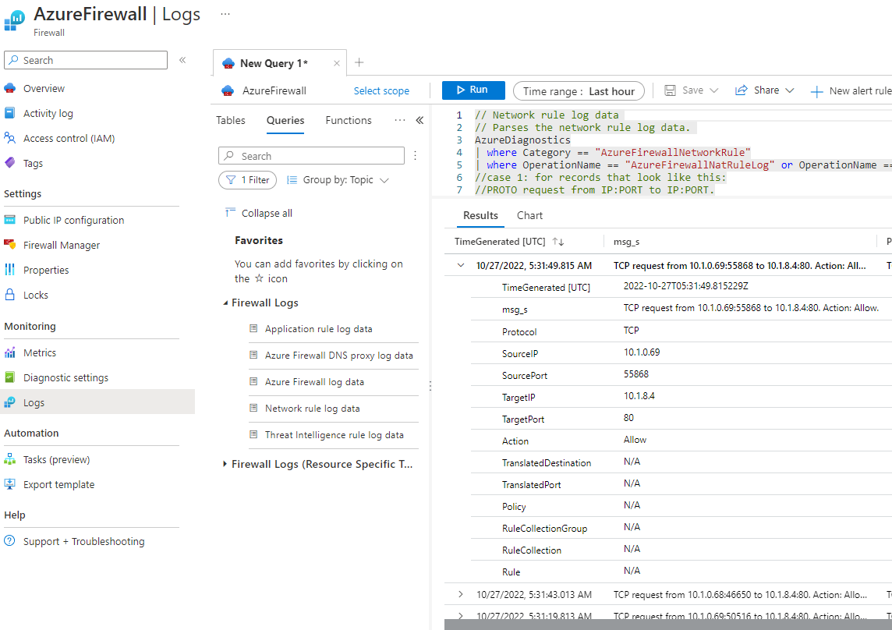

# User => Pip AzFw => WebApp VM

Scenario : Azure Firewall is used as a routing device with NAT.

Prerequisites:
* DNAT Rule in Azure FW
* Route table to spoke-vm (0.0.0.0/0 => AzFw private ip address)

```
$ cat /var/log/apache2/access.log 
10.1.0.6 - - [27/Oct/2022:04:53:08 +0000] "GET / HTTP/1.1" 304 246 "-" "Mozilla/5.0 (Windows NT 10.0; Win64; x64) AppleWebKit/537.36 (KHTML, like Gecko) Chrome/106.0.0.0 Safari/537.36"
10.1.0.5 - - [27/Oct/2022:04:53:59 +0000] "GET / HTTP/1.1" 304 247 "-" "Mozilla/5.0 (Windows NT 10.0; Win64; x64) AppleWebKit/537.36 (KHTML, like Gecko) Chrome/106.0.0.0 Safari/537.36"
```
Seen by Apache2, the source ip of the client are **Azure Firewall Private IP addresses**.


# User => Pip AG => WebApp VM

Scenario: 
* AG is used as a reverse proxy
  * Application Gateway stops the web session from the client, and establishes a separate session with one of its backend servers
```
$ cat /var/log/apache2/access.log 
10.1.0.68 - - [27/Oct/2022:04:40:12 +0000] "GET / HTTP/1.1" 200 236 "-" "-"
10.1.0.69 - - [27/Oct/2022:04:40:19 +0000] "GET / HTTP/1.1" 200 236 "-" "-"
10.1.0.68 - - [27/Oct/2022:04:40:42 +0000] "GET / HTTP/1.1" 200 236 "-" "-"
```

Seen by Apache2, the source ip of the client are **Azure Application Gateway Private IP addresses**.

# User => Pip AG => Private IP Azure Firewall => WebApp VM

Scenario :
* AG is used as a reverse proxy
* SSL offloading, WAF... 
* Azure Firewall acts as a 
  * central logging and control point
  * inspect traffic btw AG & Backend servers: AZ FW applies TLS inspection to do IDPS
* **Design approriated for applications that need to know incoming client source IP address (with X-forwarded-for)**

**Prerequisites**:
* RT on AG subnet: if you want to go to webapp, go through AzFw private ip address
* RT on webapp vm:
  * 0.0.0.0/0 => AzFw private ip address
  * Application Gateway subnet => AzFw private ip address
* Azure Firewall Network rulle allowing ag_subnet to spoke-workload subnet on TCP:80,443 (error 470 from AG Pip otherwise)

```
$ cat /var/log/apache2/access.log 
10.1.0.68 - - [27/Oct/2022:05:22:16 +0000] "GET / HTTP/1.1" 304 246 "-" "Mozilla/5.0 (Windows NT 10.0; Win64; x64) AppleWebKit/537.36 (KHTML, like Gecko) Chrome/106.0.0.0 Safari/537.36"
10.1.0.69 - - [27/Oct/2022:05:22:17 +0000] "GET / HTTP/1.1" 304 246 "-" "Mozilla/5.0 (Windows NT 10.0; Win64; x64) AppleWebKit/537.36 (KHTML, like Gecko) Chrome/106.0.0.0 Safari/537.36"
10.1.0.69 - - [27/Oct/2022:05:22:17 +0000] "GET / HTTP/1.1" 304 246 "-" "Mozilla/5.0 (Windows NT 10.0; Win64; x64) AppleWebKit/537.36 (KHTML, like Gecko) Chrome/106.0.0.0 Safari/537.36"
```

Seen by Apache2, the source ip of the client are **Azure Application Gateway Private IP addresses**.

Logs from Application Gateway (User Pip preserved in AG logs):


Logs from Azure Firewall:



# User => Pip Azure Firewall (40.68.148.42) ==DNAT==> Private IP Application Gateway (10.1.0.72) => WebApp VM (10.1.8.4)

Scenario : 
* Azure Firewall filter and discard malicious traffic before it reaches the Application Gateway (rehad intelligence-based filtering)

Cons:
* SNATs the incoming traffic, so the application will not have visibility to the original IP address of the HTTP requests (**no X-forwarded-for header possible**)

```
$ cat /var/log/apache2/access.log 
10.1.0.70 - - [27/Oct/2022:07:03:20 +0000] "GET / HTTP/1.1" 304 247 "-" "Mozilla/5.0 (Windows NT 10.0; Win64; x64) AppleWebKit/537.36 (KHTML, like Gecko) Chrome/106.0.0.0 Safari/537.36"
10.1.0.70 - - [27/Oct/2022:07:03:20 +0000] "GET / HTTP/1.1" 304 246 "-" "Mozilla/5.0 (Windows NT 10.0; Win64; x64) AppleWebKit/537.36 (KHTML, like Gecko) Chrome/106.0.0.0 Safari/537.36"
10.1.0.70 - - [27/Oct/2022:07:03:21 +0000] "GET / HTTP/1.1" 304 246 "-" "Mozilla/5.0 (Windows NT 10.0; Win64; x64) AppleWebKit/537.36 (KHTML, like Gecko) Chrome/106.0.0.0 Safari/537.36"
10.1.0.68 - - [27/Oct/2022:07:03:26 +0000] "GET / HTTP/1.1" 200 236 "-" "-"
```

Seen by Apache2, the source ip of the client are **Azure Application Gateway Private IP addresses**.

Logs from Application Gateway (User Pip preserved in AG logs):


Logs from Azure Firewall:

